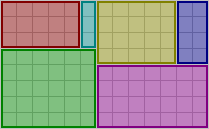

# pack
> lightweight rectangle packer

[View the demo!](https://semibran.github.io/pack)



`pack` is a [box packing algorithm](https://en.wikipedia.org/wiki/Bin_packing_problem) which attempts to determine the most compact configuration for a set of rectangles. To this end, it employs the first-fit decreasing (FFD) algorithm to place the boxes, using the length of the layout's shortest side length as a heuristic.

Unlike traditional bin packing algorithms, the boxes here are placed in a single container that grows appropriately as they are packed inside. This property makes it ideal for assembling spritesheets given a list of images.

## usage
[](https://www.npmjs.com/package/pack "View npm package")

### `pack(sizes) -> layout`
Arranges a list of `{ width, height }` pairs into the most compact `layout` possible. The result will be reminiscent of the following data structure:
```js
var layout = {
  width: 13,
  height: 8,
  rects: [
    { x: 0, y: 0, width: 5, height: 3 },
    { x: 0, y: 3, width: 6, height: 5 }
    { x: 6, y: 0, width: 5, height: 4 },
    { x: 11, y: 0, width: 2, height: 4 },
    { x: 6, y: 4, width: 7, height: 4 },
    { x: 5, y: 0, width: 1, height: 3 },
  ]
}
```

## kudos
* [leo](https://github.com/leo) - for donating the package name

## license
[MIT](https://opensource.org/licenses/MIT) © [Brandon Semilla](https://git.io/semibran)
