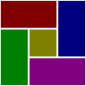

# pack
> lightweight rectangle packing algorithm

[](https://semibran.github.io/pack/ "Click to view a rough demo")

`pack` is a [box packing algorithm](https://en.wikipedia.org/wiki/Bin_packing_problem) which determines the most compact configuration for a set of rectangles. To this end, it calculates all possible [permutations](https://en.wikipedia.org/wiki/Permutation) and rates them by area of whitespace remaining.

Unlike traditional bin packing algorithms, the boxes here are placed in a single container that grows appropriately as they are packed inside. This property makes it ideal for assembling spritesheets given a list of images.

## demo
[A rough example](https://semibran.github.io/pack/) has been designed for testing and demonstration purposes.

* **Click and drag** to create a box.
* **Press `P`** to pack existing boxes.
* **Press `R`** to generate a random configuration.
* **Press `N`** to reset the layout to its initial state.

In this demo, boxes are chunked into groups of 4 as they are packed together to reduce calculation times. Unfortunately, this approach tends to yield suboptimal results. This issue will be addressed as library performance is improved upon.

## usage
[](https://www.npmjs.com/package/pack "View npm package")

### `pack(sizes[, layout]) -> layout`
Arranges a list of `[ width, height ]` pairs into the most compact `layout` possible. The result will be reminiscent of the following data structure:
```js
var layout = {
  size: [ 13, 8 ],
  boxes: [
    { size: [ 5, 3 ], position: [ 0, 0 ] },
    { size: [ 6, 5 ], position: [ 0, 3 ] }
    { size: [ 5, 4 ], position: [ 6, 0 ] },
    { size: [ 2, 4 ], position: [ 11, 0 ] },
    { size: [ 7, 4 ], position: [ 6, 4 ] },
    { size: [ 1, 3 ], position: [ 5, 0 ] },
  ]
}
```
The boxes will be placed around the provided `layout` if given (this is used internally for recursion), otherwise an empty one will be created.

## kudos
* [leo](https://github.com/leo) - for donating the package name

## license
[MIT](https://opensource.org/licenses/MIT) © [Brandon Semilla](https://git.io/semibran)
